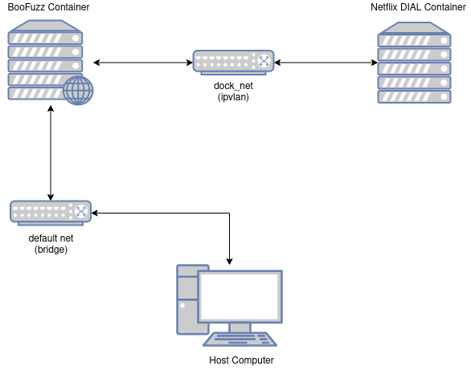
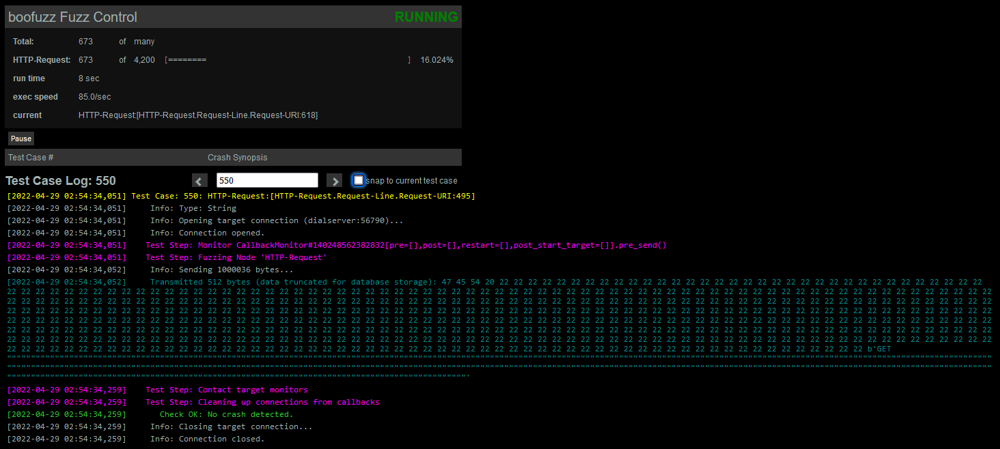

# Netflix DIAL Server Example
In this example we rediscover a bug in Netflix DIAL Server assigned to 
[CVE-2019-10028](https://nvd.nist.gov/vuln/detail/CVE-2019-10028) with a CVSS score of 7.5.

## Setup
To setup this lab it is as simple as hacking `Docker` and `Docker compose` command installed.
Make sure your docker compose version is above version 2 with:
```bash
$ docker compose version
Docker Compose version v2.4.1
```

Now all you have to do is run:
```bash
docker compose up
```

You should see a lot of data being run and fill up the stdout of your terminal. In another 
terminal you can verify two conatiners are running:

```bash
$ docker ps
CONTAINER ID   IMAGE                                   COMMAND                  CREATED        STATUS          PORTS                                           NAMES
2ecd00fd9968   netflix-dial-http-server_boofuzz        "python3 /fuzzer.py"     20 hours ago   Up 32 seconds   0.0.0.0:26000->26000/tcp, :::26000->26000/tcp   netflix-dial-http-server-boofuzz-1
43173e5a2321   netflix-dial-http-server_netflix-dial   "/fuzz/server/dialse…"   20 hours ago   Up 32 seconds                                                   netflix-dial-http-server-netflix-dial-1
```

The network is setup like the following:



This means you _only_ access the `boofuzz` instance from your host network. To check on the BooFuzz progress
you can open this address in your browser: [http://localhost:26000](http://localhost:26000). The interface
should look like:



After running for around two minutes, you should notice that your containers all stop running. This is because
BooFuzz has sucessfuly crashed the Netflix DIAL Server. If you look at the last thing BooFuzzer sent before 
going down you will find the crashing packet:

```
netflix-dial-http-server-boofuzz-1       | [2022-04-29 21:39:18,146]   Test Step: Fuzzing Node 'HTTP-Request'
netflix-dial-http-server-boofuzz-1       | [2022-04-29 21:39:18,146]     Info: Sending 65 bytes...
netflix-dial-http-server-boofuzz-1       | [2022-04-29 21:39:18,146]     Transmitted 65 bytes: 47 45 54 20 2f 69 6e 64 65 78 2e 68 74 6d 6c 20 48 54 54 50 2f 31 2e 31 0d 0a 43 6f 6e 74 65 6e 74 2d 4c 65 6e 67 74 68 3a 20 36 31 34 38 39 31 34 36 39 31 32 33 36 35 31 37 32 30 37 0d 0a 0d 0a b'GET /index.html HTTP/1.1\r\nContent-Length: 6148914691236517207\r\n\r\n'
```

It should look something like this, which is the same as the CVE provided [poc](./poc). Congrats, you have
rediscovered a major bug using BooFuzz.
